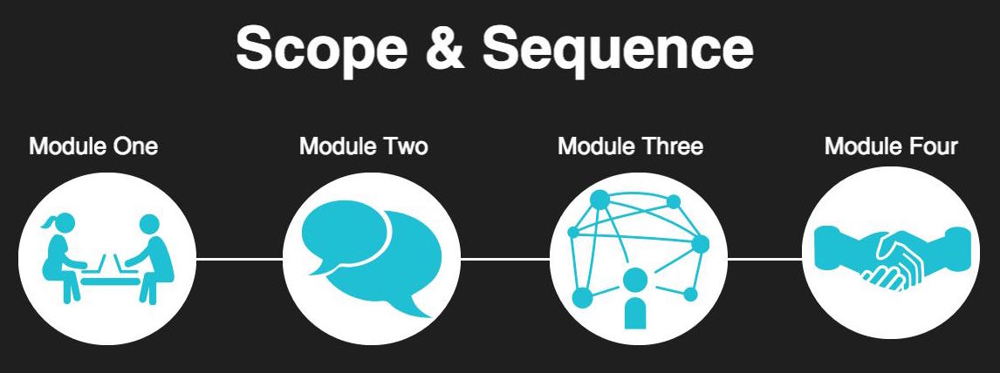

# Career Development Curriculum

Turing’s **mission** is to unlock human potential by training a diverse, inclusive student body to succeed in high-fulfillment technical careers. 

Turing’s career development curriculum is created directly out of this mission with a focus on **unlocking students’ potential** in modules one and two through cultivating self-awareness and empathy. In modules three and four, curriculum focuses on providing strategies to empower students to **succeed in high-fulfillment technical careers** by creating connections within the technology industry, building competencies for industry leadership, and securing a fulfilling career -- and not just another job. 

The touchstones of this curriculum include these mindsets: 

* **Agency:** Taking initiative and ownership over your learning and work
* **Empathy:** Understanding and sharing others' emotions in order to relate to them 
* **Engagement:** Active participation in community
* **Grit:** A combination of perseverance and passion
* **Growth:** A belief that your abilities can be developed through dedication, hard work, and resiliency

Through this development, upon graduation, students will be able to communicate who they are and what they know, collaborate with teams, adapt to changing situations, execute their ideas, and solve problems as junior software developers. 

In this repo, you'll find all of the curriculum for career development, including information on how each session fits into the end goals for students. Click on the links below to see more information as well as links to sessions within each module folder:

* [Module One](https://github.com/turingschool/career-development-curriculum/tree/master/module_one)
* [Module Two](https://github.com/turingschool/career-development-curriculum/tree/master/module_two)
* [Module Three](https://github.com/turingschool/career-development-curriculum/tree/master/module_three)
* [Module Four](https://github.com/turingschool/career-development-curriculum/tree/master/module_four)

### Deliverables

* Module One deliverables should submitted [here](https://docs.google.com/forms/d/1XGgtEs30A6l38jIe4zSWyjSGH2jJokRblt-UJEIXNoM/edit)
* Module Two deliverables should be submitted [here](https://goo.gl/forms/KkVjm4ja147Nk6Zm1)

Modules Three & Four deliverables will be checked during portfolio reviews.

### Career Development Team at Turing
Your career development team consists of:

* Allison Reu Singer, Professional Development Lead & Coach
* Ellen Mary Hickmann, Director of Professional Learning
* Kayt Hensley, Initiatives Coordinator

